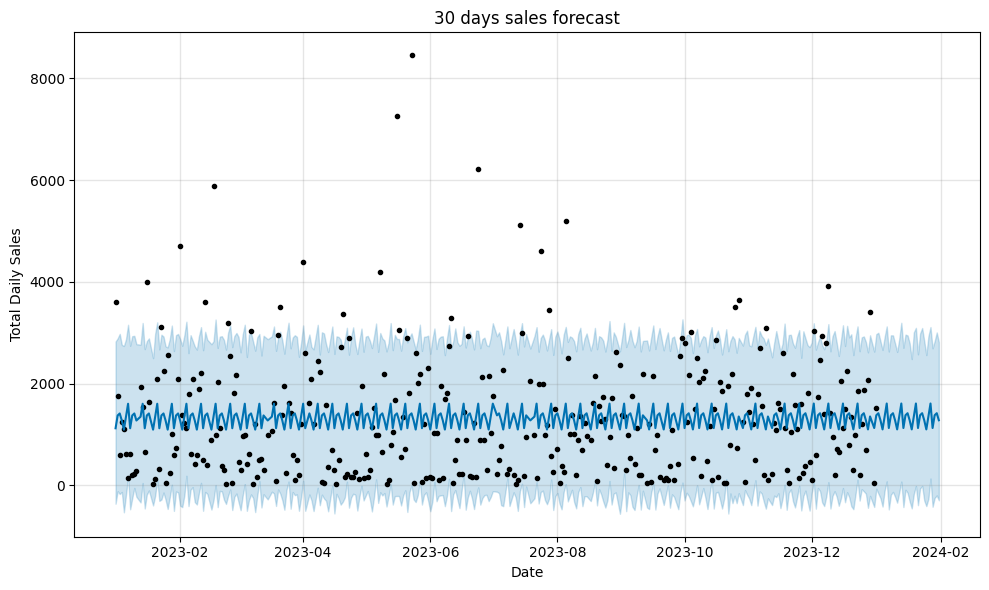

#  Sales Forecasting for a Retail Store

This project uses historical transaction data to **forecast daily sales for the next 30 days** using Meta’s open-source time series model, **Prophet**.  
The forecast helps with **inventory planning, staff allocation, and marketing decisions**.

---

##  Objective

To predict future daily sales based on past transaction data using machine learning (Prophet) and visualize the trends.

---

##  Dataset

- Format: CSV
- Columns used:
  - `transaction_id`
  - `date`
  - `total_amount`
- Duration: 1 year of transaction data (daily)

---

##  Tools Used

| Tool        | Purpose                          |
|-------------|----------------------------------|
| `pandas`    | Data cleaning and manipulation   |
| `Prophet`   | Time series forecasting model    |
| `matplotlib`| Visualization of forecast        |

---

## Process Overview

1. **Load & Clean Data**
   - Convert `date` to datetime format
   - Filter out invalid values

2. **Aggregate Daily Sales**
   - Group by `date` to get total daily `sales`

3. **Rename Columns**
   - `date` → `ds`  
   - `total_amount` → `y`  
   *(required for Prophet)*

4. **Forecasting**
   - Train Prophet model
   - Predict next 30 days
   - Plot results with confidence intervals

5. **Insights**
   - Identify average expected sales
   - Highlight peak or low-demand periods

---

## 📈 Sample Output

- Blue line → predicted daily sales  
- Light blue area → prediction confidence range  
- Black dots → actual past sales

  

---

## Outcome

- Helps the business **plan inventory and workforce**
- Identifies **sales trends and peak demand periods**
- Provides a **data-driven forecast** to guide future decisions

---

##  Future Work

- Forecast by product category or customer segment
- Include holiday effects
- Build Flask + React dashboard (optional)

---

## Author

> Intern: Jemuna
> Guided by: Angesh 
> Tools: Python, Jupyter/Colab, Prophet

